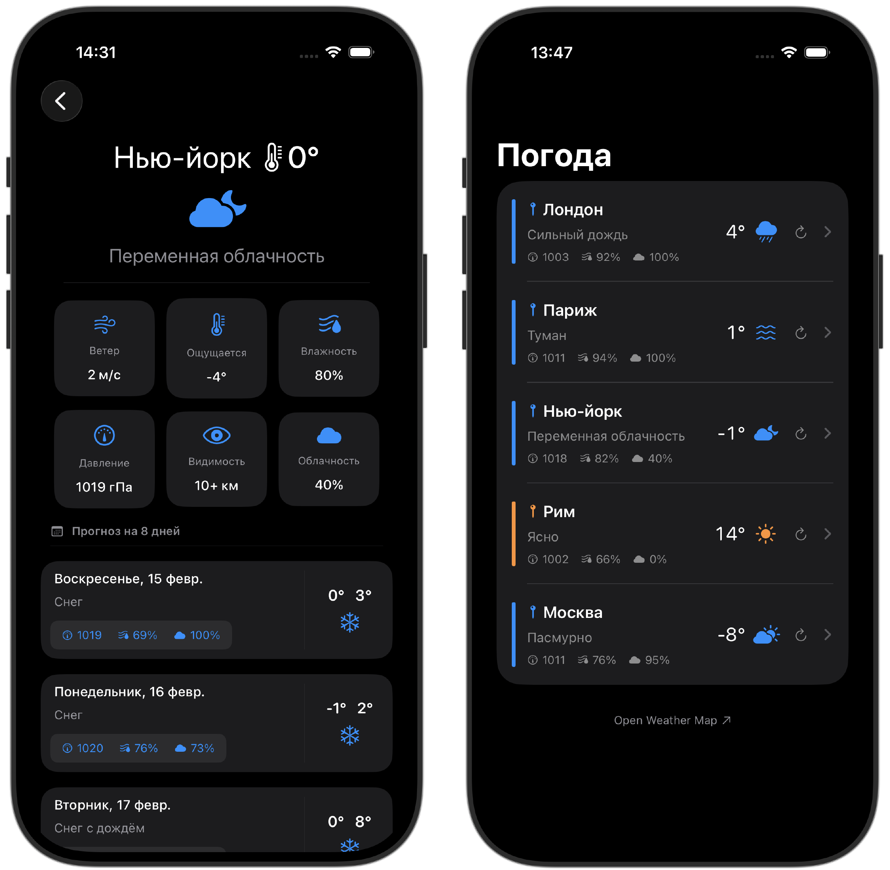

# SkyView ✨

## Стек
- **iOS 16+**
- **SwiftUI** 
- **async/await** 
- **C++** парсинг JSON через библиотеку [taocpp/json](https://github.com/taocpp/json) (мост Obj-C++ в Swift)
- [Open Weather Map API](https://openweathermap.org/api)

## Клонировать

```bash
git clone https://github.com/alvdalen/SkyView.git
cd SkyView
```

## Структура проекта  

```
SkyView/
├── SkyView.xcodeproj     # Проект Xcode
├── README.md
├── assets/               # Скриншоты приложения
│
├── SkyView/              # Исходный код приложения
│   ├── App/              # Точка входа, контейнер зависимостей
│   ├── Configuration/    # Список городов
│   ├── Entities/         # Модели
│   ├── Networking/       # Сеть, загрузка по URL, типы ошибок
│   ├── Parsing/          # Разбор JSON (C++ мост), маппинг в сущности
│   ├── Repositories/     # Репозиторий погоды и заглушка для превью
│   ├── UseCases/         # Сценарии: загрузка по всем городам и по одному
│   ├── Presentation/     # Экраны (список, детали), ViewModel, общие модификаторы
│   └── Resources/        # Локализация, ассеты, иконки
│
├── SkyViewTests/         # Тестовый таргет
│   ├── Doubles/          # Моки 
│   ├── Fixtures/         # JSON-фикстуры для парсера
│   └── Tests/            # Юнит-тесты (ViewModel, парсер)
│
└── Vendor/               # C++ зависимости (taocpp-json, taocpp-pegtl)
```

## Скриншоты




